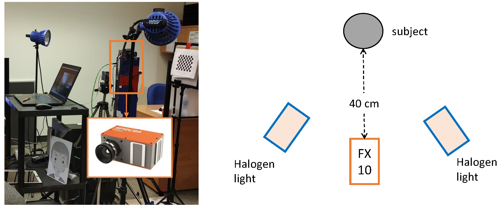

# ICASSP 2024 SP Grand Challenge on Hyperspectral Skin Vision

<!-- ## Introduction -->
Introducing ICASSP 2024 SPGC competition aiming at reconstructing skin spectral reflectance in the visible (VIS) and near-infrared (NIR) spectral range from RGB images captured by everyday cameras, offering a transformative approach for cosmetic and beauty applications. 
By reconstructing the skin spectral reflectance in both VIS and NIR spectrum, this competition aims to provide rich hyperspectral information accessible on consumer devices. With the reconstructed skin spectral, we pave the way for the creation of personalized beauty and skincare solutions directly through consumers' smartphones and other accessible devices.
With the goal of democratizing skin analysis and advancing the field of beauty technology, this competition invites computer vision researchers, machine learning experts, and cosmetic professionals to contribute to a future where personalized beauty and skincare are accessible to all.

## Dataset
The data that will be used in the competition is carefully collected and curated following the ethical guidelines approved by the Human Research Ethics Program (HREP) at the University of Toronto. 
Figure below shows the schematic of our setup for the data collection.
The image on the right side illustrates our experimental set up for the data collection, while the right side provides a schematic representation of the set up.
The hyperspectral camera used to collect the hyperspectral image is Specim FX10. 
The Specim FX10 camera has a spectral range of 400-1000 nm, with a total of 448 bands, and a spatial resolution of 1024 $\times$ 1024 pixels. 
The frame rate of the camera is set to 45 Hz. 
Since the Specim FX10 is a line-scan camera, it took approximately 22.7 s to finish scan the entire hypercube of dimension 1024 $\times$ 1024 $\times$ 448.
The camera was placed at a distance of 40 cm from the subject, who was required to sit on a stool during the data collection. To ensure sufficient lighting for the imaging process, two halogen lights were used and pointed at 45 degrees to the subject. The halogen lights were used because they have a broad spectrum and provide stable illumination for the imaging process.

A total of six images were captured for each subject: three neutral images (left, front, right) and three smiling images (left, front, right). 
A total of 51 subjects (27 male and 24 female, age from 17 to 60, 46 Asian, 4 European, and 1 Latino) participated in the experiments, with six images per participant. 
In total, there are 306 hyperspectral images and their corresponding RGB images will be used for the competition.
During data collection, participants' personal information will not be recorded in the database, and only a file linking unique ID numbers to participants.
All the data is collected with permission from participants who sign an informed consent form, and the data is ready for use in the competition. 

Please refer to this [link](https://hyper-skin-2023.github.io/) for the dataset description and the instructions to access the data.

### Task 
The skin spectral reconstruction task aims to reconstruct the skin spectral image cube from the given RGB image. 
Given the pair of masked RGB $\tilde{R}$ and skin spectral images $\tilde{S}$ described previously, the task can be formulated as finding a mapping function $f$ that maps $\tilde{R}$ to $\tilde{S}$, as described below:

$$
    \tilde{S} = f(\tilde{R}; \Theta).
$$ 

The function $f(\cdot; \Theta)$ parameterized by $\Theta$ can be implemented using a deep learning model or any other analytical model that can effectively learn the mapping between RGB and hyperspectral images.
The problem posed by our proposed competition is both scientifically and technically challenging, but not impossible to solve. 
Accurately estimating skin reflectance requires a deep understanding of color imaging, spectral analysis, and the physics of light interaction with biological tissues. 
However, similar problems have been successfully tackled in other application domains, demonstrating that with the right approach and tools, such challenges can be overcome. 
The key to success lies in leveraging the latest advancements in computer vision and machine learning, along with rigorous data collection and preprocessing, to extract meaningful information from complex and noisy data.

### Evaluation Criteria

### Baseline
For the task to skin spectral reconstruction, we will use the [Mask-guided Spectral-wise Transformer (MST)]() published in the last year's CVPR conference as the baseline solution. This method leverages a transformer-based architecture that takes RGB images as input and generates corresponding skin spectral data. 
The data loading and baseline methods are provided [here](https://github.com/hyperspectral-skin/Hyper-Skin-2023).

## Timeline

## Important Date

## Sponsor

